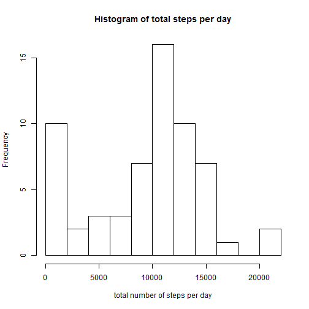
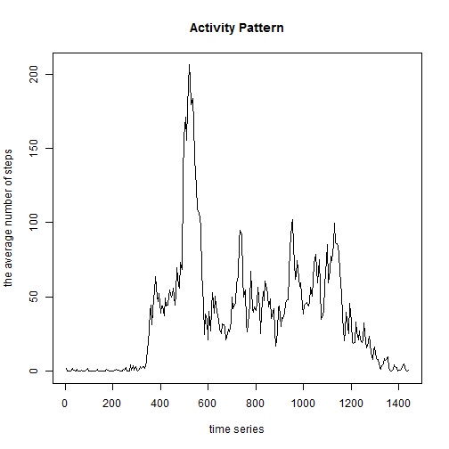
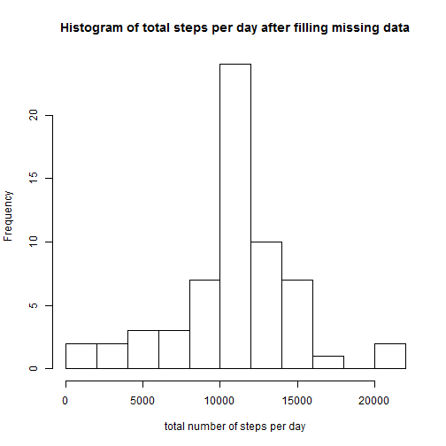
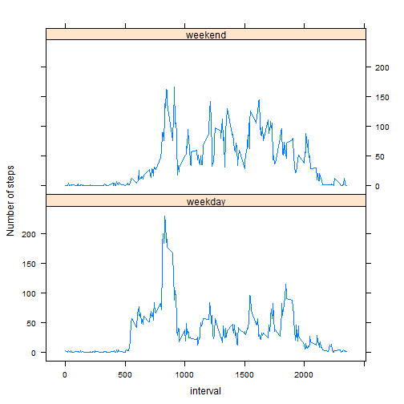

# Reproducible Research: Peer Assessment 1


## Loading and preprocessing the data


```r
unzip("activity.zip")
origin <- read.csv("./activity.csv")
```


## What is mean total number of steps taken per day?


```r
data <- origin[!is.na(origin[, 1]), ]
s <- split(data, data$date)
a <- sapply(s, function(x) sum(x[, 1]))
hist(a, main = "Histogram of total steps per day", breaks = 15, xlab = "total number of steps per day")
```

 


The mean of the total number of steps taken per day is 9354;  
the median of the total number of steps taken per day is 10395.

## What is the average daily activity pattern?

```r
s <- split(origin, origin$interval)
a <- sapply(s, function(x) mean(x[, 1], na.rm = TRUE))
x <- 5 * (1:length(a))
plot(x, a, type = "l", xlab = "time series", ylab = "the average number of steps", 
    main = "Activity Pattern")
```

 


104 index of 5-minute interval, on average across all days in the dataset, contains the maximum number of steps.


## Imputing missing values


The total number of missing values in the dataset is 2304.

The following code is to fill in all of the missing step values with the mean steps for that 5-minute interval.

```r
temp <- sapply(s, function(x) mean(x[, 1], na.rm = TRUE))
for (i in seq(nrow(origin))) {
    if (is.na(origin[i, 1])) {
        if (!(i%%288 == 0)) {
            origin[i, 1] = floor(temp[i%%288])
        } else {
            origin[i, 1] = floor(temp[288])
        }
    }
}
```


```r
s1 <- split(origin, origin$date)
a1 <- sapply(s1, function(x) sum(x[, 1]))
hist(a1, main = "Histogram of total steps per day after filling missing data", 
    breaks = 15, xlab = "total number of steps per day")
```

 


After filling the missing data, 
The mean of the total number of steps taken per day is 1.0749 &times; 10<sup>4</sup>;  
the median of the total number of steps taken per day is 1.0641 &times; 10<sup>4</sup>.  
These values differ from the estimates from the first part of the assignment.  
Imputing missing data will increase on the estimates of the total daily number of steps. 


## Are there differences in activity patterns between weekdays and weekends?

```r
days <- as.Date(origin[, 2])
wd <- weekdays(days) == "Sunday" | weekdays(days) == "Saturday"
wd[wd == TRUE] = "weekend"
wd[wd == FALSE] = "weekday"
wd <- factor(wd)
origin <- cbind(origin, wd)

library("reshape2")
library("lattice")
Melt <- melt(origin, id = c("interval", "wd"), measure.vars = "steps")
Cast <- dcast(Melt, interval + wd ~ variable, mean)
head(Cast)
```

```
##   interval      wd  steps
## 1        0 weekday 2.1556
## 2        0 weekend 0.1250
## 3        5 weekday 0.4000
## 4        5 weekend 0.0000
## 5       10 weekday 0.1556
## 6       10 weekend 0.0000
```

```r
xyplot(steps ~ interval | wd, data = Cast, type = "l", ylab = "Number of steps", 
    layout = c(1, 2))
```

 


